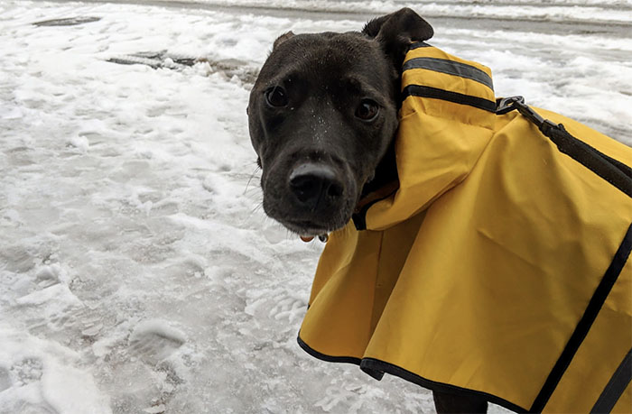
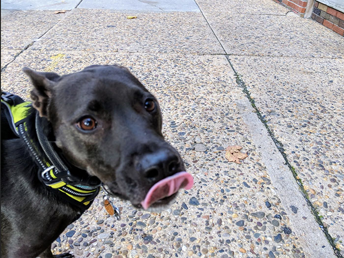

# Automatically download photos from a link in an email via Google Apps Scripts

Okay, here's a very specific problem that I solved:

My partner and I hire an amazing dog walking service in Philadelphia.  On most days that they walk our dog, they'll send a picture or two of her, along with a short description of the walk, as a "report card."

This seriously brightens my day every single day.  So, clearly, I wanted to make sure these images were never lost to time.

If you know a little bit of javascript, it turns out it isn't that difficult to set up a Google Apps Script to:

* Find specific emails
* Go to a URL in an email
* Find an image (or more) on that page
* Download the image and
* Upload it to Google Drive

You'll need to do some work before the code that's in the /src file will work.

First:  create a new google apps script project. Go ahead and copy the Code.gs content directly into your open Code.gs file.

Next, create a label for the emails you want to scrape.  You can do this by creating a search filter, selecting "create label...," and optionally applying the label to previous messages.  Put the name of the label (as typed) in the file as the variable's value.

Next, create a new google sheet, get the id from the url (it's the long hash-sembling string) and add it to the file.  You'll also need to do this for a Drive folder.

The hardest part of all of this will probably be to create a good regex match to find the urls you want. An easier way to do this would be to use an online tool like regex101.com: find the source of both the email and the page you want to scrape and create a regex test which only returns the urls you want and put them in the script.  I had to add a bit of garbage to the front and end of my queries to make sure the right urls were found:  you'll have to edit the `substr` functions on lines 48 and 56 to match yours.

(Note that the current state of this script only looks for one link in and email and multiple links on the page we go to:  if you want to change this, you'll have to refactor.)

Finally, run it!  The first time you run it, you'll see an extremely scary pop-up asking you if you _really_ want to give this script permission to access all of your emails, google sheets, and google docs.  Take a quick glance over the code to assure yourself that this is an okay thing to do, then click advanced and proceed.  You'll also get two more emails letting you know that you've set up an app with an absurd permission level.  Good security mindset, Google Apps Script team!

If you don't see any errors, you did it right!  Hurray!  

You'll now need to do two more things:

* Go to your sheet and sort the column A-Z.  You'll only have to do this the first time your script runs (and it was faster for me to do that than to write out the logic to accommodate the first run)
* Go to script.google.com and add a new trigger for your script.  I've set mine to run every day, an hour or so after we normally get the email.

And that's it!  Go forth and archive. 

